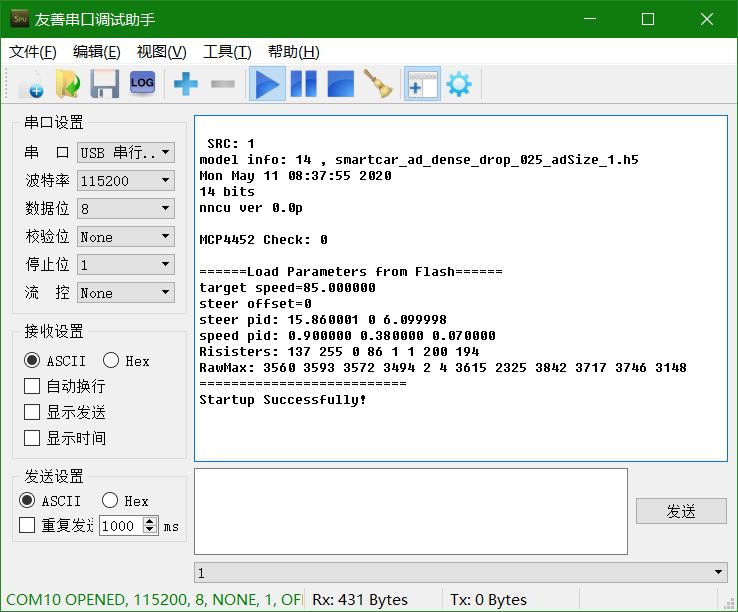
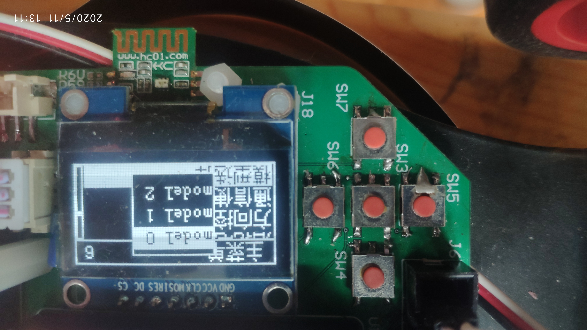
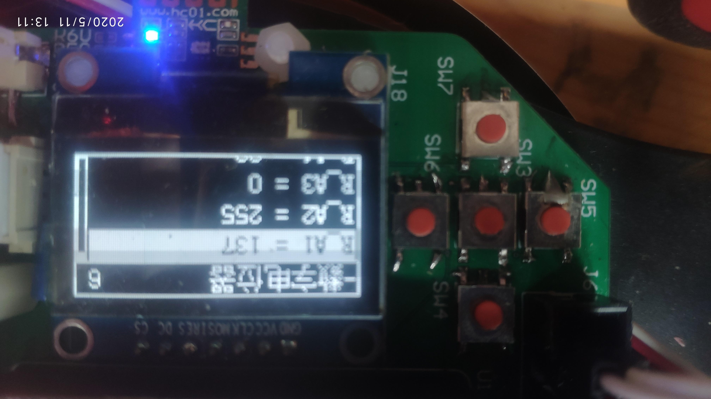
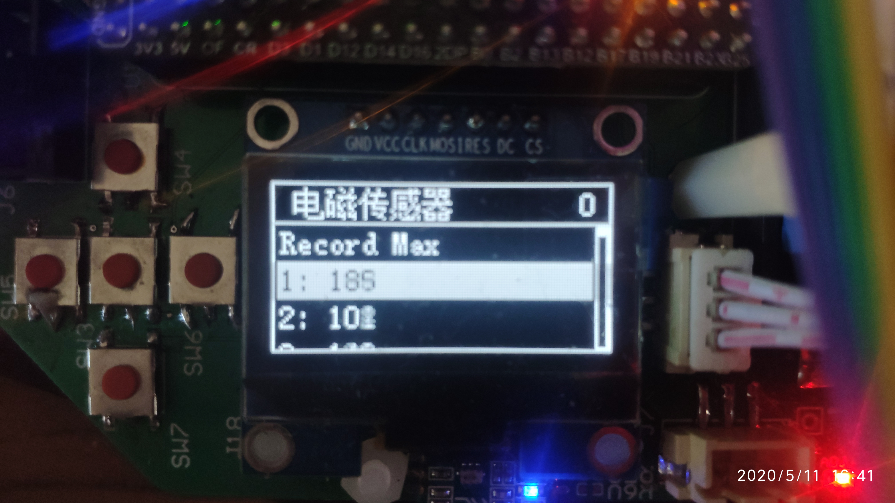
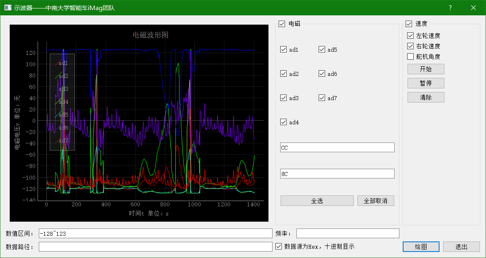
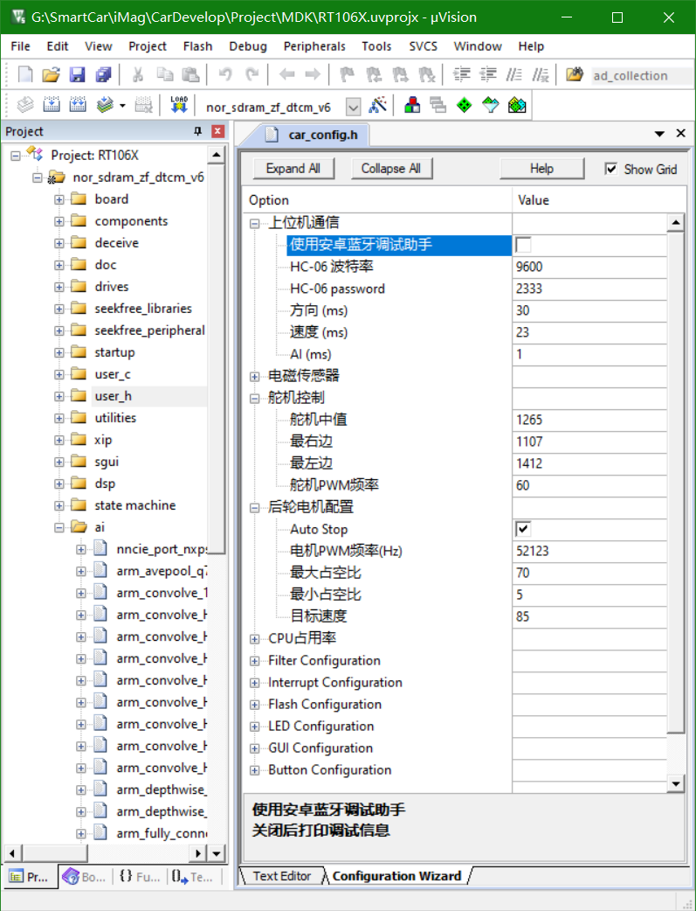

# :zap:电磁AI智能车

采集数据发送至上位机、运行训练好的模型
# :sparkles:FEATURE
- :rocket:纯电磁四轮
- :ambulance:基于状态机的**出轨、堵转**保护
- :art:1.3吋OLED与6个按键的*中文*GUI
- :boom:**一键**切换AI模式与PID模式！
- :card_file_box:可在*运行时*切换AI模型
- :wrench:在Keil中通过GUI配置全车参数
- :zap:PID采用CMSIS-DSP库实现
- :zap:兼顾效率与灵活性的滑动平均滤波器
- :lock:运行时错误检查：`CAR_ERROR_CHECK`
- :arrow_heading_up:*极简*[调度器](https://github.com/CSU-iMag/ArtificialIntelligenceCar/blob/master/Project/CODE/utility/scheduler.hpp)
- :clock3:基于*平衡二叉树*的[软件定时器](https://github.com/CSU-iMag/ArtificialIntelligenceCar/blob/master/Project/CODE/utility/timer.hpp)
- :battery:低电量自动关机
- :recycle:`std::set_new_handler`
# :eyes:PREVIEW
## 控制台
> 复位后打印的内容

## 开始
> 图中柱子是电池电量，数字是“CPU占用率”

## 主页
> 右上角数字代表“CPU占用率”的位数

## 模型选择

> 预存了3个model.nncu.c，可在运行时切换。
## 控制面板

## 电机设置

## 方向控制

## 数字电位器

## 电磁传感器

> 单击切换显示方式
## 显示波形

## 配置参数

# :octocat:LIBRARY
> 致敬开源！
- [nncu](https://github.com/RockySong/nncu_tool)
- [SimpleGUI](https://gitee.com/Polarix/simplegui)
- [逐飞科技RT1064开源库](https://gitee.com/seekfree/RT1064_Library)
- [StateMachineCompact](https://online.visual-paradigm.com/w/twpaunrw/drive/#diagramlist:proj=0&log)
- [MCUXpressoSDK](https://mcuxpresso.nxp.com/api_doc/dev/1406/modules.html)
- [DSP](https://github.com/ARM-software/CMSIS_5/tree/develop/CMSIS/DSP/Source)
# :pushpin:DEPENDENCE
- 开发环境：Keil 5.30
- 编译器：ArmClang V6.14
- 使用MCUXpresso Config Tool初始化时钟和外设
- 请使用Keil打开`car_config.h`
# 十五届必胜 :tada: :tada: :tada:
